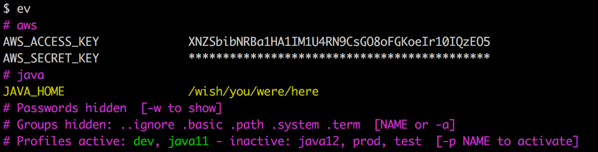
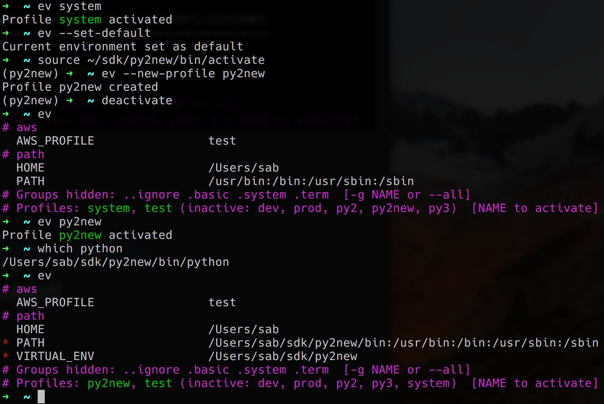
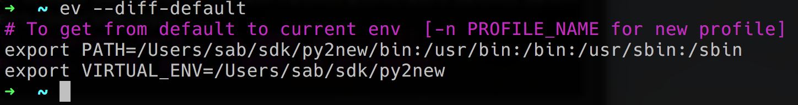

# envirou - Manage your shell environment variables

Simple utility to view and manage your shell `env`.

Everyone that works with complex infrastructure from the command line has gathered dozens and
sometimes hundreds of files that manipulate your command line environment.  Classical examples 
are PATH's to tools/SDK versions, external service endpoints for your PROD and DEV environments
etc etc.

There are two basic problems with this: firstly you are having to memorize a bunch of script 
names and secondly you are never 100% which environment is active at any point and in which 
shell window.
 
Tools such as zsh (oh-my-zsh) and shell prompt configuration but those are fragile and 
complicated to set up and add clutter to your terminal session window.

The name Envirou is inspired by Spirou the comic book character.  
The alias `ev` is both short for *Envirou* and `env`. 


## Features 

* Fully customizable env variable groups (aws, java).
* Quickly switch between profiles (test vs dev).
* Hide "useless" environment variables (SHLVL, LSCOLORS).
* Quickly diff changes in your environment and create new profiles.
* Prevent passwords to be revealed accidentally.
* Color code important ones.
* Works on Mac OS X and Linux, bash and zsh.

## Quickstart

```bash
$ git clone https://github.com/sverrirab/envirou.git
$ ./envirou/install
$ ev
$ ev --help     # Get information on how to use.
```

## How to use 

See the below screenshot for an example on how `ev` can switch between different
python runtime and aws profiles with a single command line:


See how the selected profiles are highlighted.


Create a new profile using a python virtualenv:



See how the variables that have changed are marked with a red asterisk.
You can also ask `ev` what has changed if you don't want to use the profile feature:




## Advanced configuration

Edit the ini file:

```bash
$ ev --edit     # Customize settings.
```

Example from `envirou.ini`:

```inifile
[profile:system]
PATH=/usr/bin:/bin:/usr/sbin:/sbin:
VIRTUAL_ENV

[profile:py2]
PATH=/Users/sab/sdk/py2/bin:/usr/bin:/bin:/usr/sbin:/sbin:
VIRTUAL_ENV=/Users/sab/sdk/py2

[profile:py3]
PATH=/Users/sab/sdk/py3/bin:/usr/bin:/bin:/usr/sbin:/sbin:
VIRTUAL_ENV=/Users/sab/sdk/py3

[profile:prod]
AWS_PROFILE=production

[profile:test]
AWS_PROFILE=test

[profile:dev]
AWS_PROFILE=development
```


# License

Free for any use see [MIT License](./LICENSE) for details.
