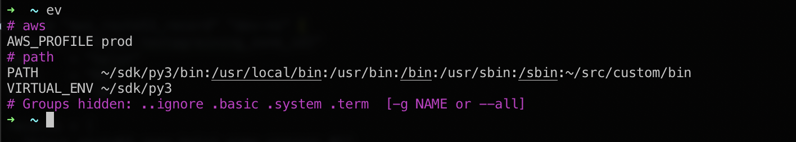
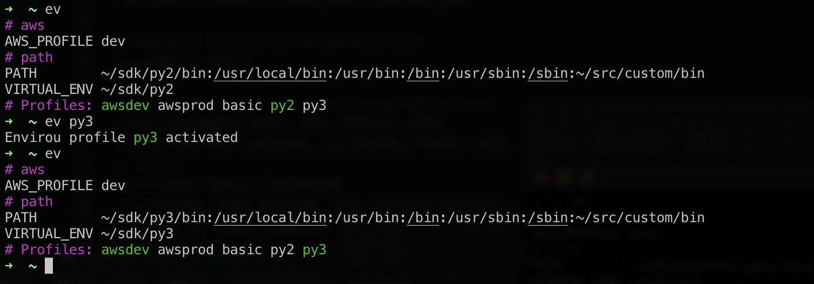
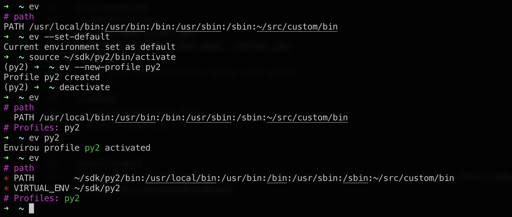

# envirou - View and manage your shell environment

Envirou (`ev`) helps you to quickly configure your shell environment. 

Example using starting configuration:


After simple configuration changes you can use it to switch python profiles:


Key hightlights: 
* Shows instantly what profiles are active (`dev` AWS profile above).
* Compact output (replaces $HOME with `~` and _underscores_ paths for readability).
* Hides all irrelevant variables such as `TMPDIR`, `LSCOLORS` etc, etc.
* Works with any other tool - just views and optionally sets environment variables.
* Simple to customize.
* Works on Mac / Linux using bash and zsh.  
* Fully standalone with no dependencies - uses any python 2.7 or 3.4+ you have installed.

## Quickstart

```bash
$ git clone https://github.com/sverrirab/envirou.git
$ ./envirou/install
$ ...
$ ev --help     # Get information on how to use.
```

## Create a new python profile



## Example use cases
### AWS configuration
Add all your aws profiles in `~/.aws/config`.  Then create an Envirou profile for each
that sets the `AWS_PROFILE` variable to the name of the AWS profile.  This way you can
easily e.g. switch between `dev` and `prod` or even the default region or output formatting.

### Kubectl configuration
Copy your `~/.kube/config` into a new file for each environment.  Create an Envirou 
profile for each that sets the `KUBECONFIG` pointing to each file.

Make sure you set the default context in each file to be the correct one.  This way you
can create different profiles that for example have a different default namespace.

## Advanced configuration

Edit the ini file:

```bash
$ ev --edit     # Customize settings.
```

Example from `envirou.ini`:

```inifile
[profile:basic]
PATH=/usr/local/bin:/usr/bin:/bin:/usr/sbin:/sbin:/Users/sab/src/custom/bin
VIRTUAL_ENV
AWS_PROFILE

[profile:py3]
PATH=/Users/sab/sdk/py3/bin:/usr/local/bin:/usr/bin:/bin:/usr/sbin:/sbin:/Users/sab/src/custom/bin
VIRTUAL_ENV=/Users/sab/sdk/py3

[profile:py2]
PATH=/Users/sab/sdk/py2/bin:/usr/local/bin:/usr/bin:/bin:/usr/sbin:/sbin:/Users/sab/src/custom/bin
VIRTUAL_ENV=/Users/sab/sdk/py2

[profile:awsprod]
AWS_PROFILE=prod

[profile:awsdev]
AWS_PROFILE=dev
```

## Why?
Everyone that works with complex infrastructure from the command line has gathered dozens and
sometimes hundreds of files that manipulate your command line environment.  Classical examples 
are PATH's to tools/SDK versions, external service endpoints for your PROD and DEV environments
etc etc.

There are two basic problems with this: firstly you are having to memorize a bunch of script 
names and secondly you are never 100% which environment is active at any point and in which 
shell window.
 
Tools such as zsh (oh-my-zsh) and shell prompt configuration but those are fragile and 
complicated to set up and add clutter to your terminal session window.

The name Envirou is inspired by Spirou the comic book character.  
The alias `ev` is both short for *Envirou* and `env`. 


## License

Free for any use see [MIT License](./LICENSE) for details.
