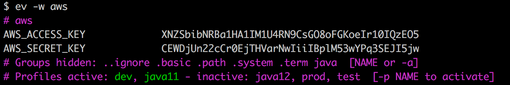
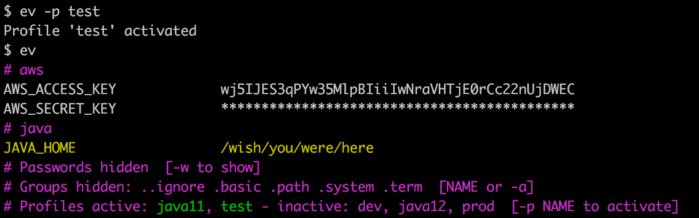

# envirou - Manage your shell environment variables

Simple utility to manage your shell `env`.  

# Features 

* Fully customizable env variable groups (aws, java).
* Quickly switch between profiles (test vs dev).
* Color code important ones.
* Quickly diff changes in your environment.
* Prevent passwords to be revealed accidentally.
* Hide "useless" environment variables (SHLVL, LSCOLORS).

# Quickstart

```bash
$ git clone git@github.com:sverrirab/envirou.git
$ ./envirou/install
$ ev
$ ev --help     # Get information on how to use.
```

# Screenshots 

Basic usage:


Show only the `aws` group with passwords `-w`



Activate the `test` profile.  Note that there are new keys and `test` is highlighted instead of `dev`.




# Configuration

Edit using:

```bash
$ ev --edit     # To customize settings.
```

Example:

```inifile
[custom]
aws=AWS_ACCESS_KEY, AWS_SECRET_KEY
java=JAVA_HOME

[highlight]
password=AWS_SECRET_KEY
yellow=JAVA_HOME

[profile:prod]
AWS_ACCESS_KEY=5OEzQI01rIeoKGFo8OGsC9NR4U1MI1AH1aBRNbibSZNX
AWS_SECRET_KEY=wj5IJES3qPYw35MlpBIiiIwNraVHTjE0rCc22nUjDWEC

[profile:test]
AWS_ACCESS_KEY=wj5IJES3qPYw35MlpBIiiIwNraVHTjE0rCc22nUjDWEC
AWS_SECRET_KEY=5OEzQI01rIeoKGFo8OGsC9NR4U1MI1AH1aBRNbibSZNX

[profile:dev]
AWS_ACCESS_KEY=XNZSbibNRBa1HA1IM1U4RN9CsGO8oFGKoeIr10IQzEO5
AWS_SECRET_KEY=CEWDjUn22cCr0EjTHVarNwIiiIBplM53wYPq3SEJI5jw

[profile:java11]
JAVA_HOME=/wish/you/were/here

[profile:java12]
JAVA_HOME=/hope/we/never/get/here
```

# Background

Everyone that works with complex infrastructure from the command line has gathered dozens and sometimes hundreds of files that manipulate your command line environment.  Classical examples are PATH's to tools/SDK versions, external service endpoints for your PROD and DEV environments etc etc.

There are two basic problems with this: firstly you are having to memorize a bunch of script names and secondly you are never 100% which environment is active at any point and in which shell window.
 
Tools such as zsh (oh-my-zsh) and shell prompt configuration but those risk adding too much clutter to your terminal session window.

The name Envirou is inspired by Spirou the comic book character.  
The alias `ev` is both short for *Envirou* and `env`. 

# License

Free for any use - see [MIT License](./LICENSE) for details.
