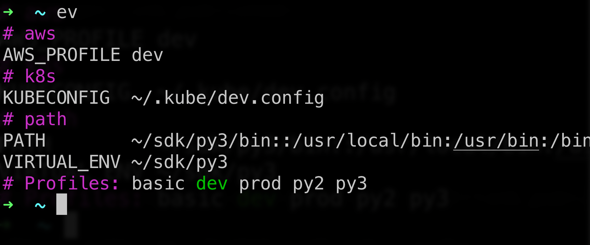

# envirou - View and manage your shell environment

[](https://github.com/sverrirab/envirou/actions/workflows/build.yml)

Envirou (`ev`) helps you to quickly view and configure your shell
environment. Display important variables with nice formatting and hide the ones you don't care about. No more custom shell scripts to configure your environment or guessing which one is active!




# Key highlights
* Works with any other tool - just views and optionally sets environment variables.
* Compact output (replaces $HOME with `~` and _underscores_ paths for readability).
* Hides all irrelevant variables such as `TMPDIR`, `LSCOLORS` etc, etc.
* Fully customizable.
* Works on Mac + Linux (bash + zsh) and Windows (bat and PowerShell).
* Fully standalone go binary.
* Command completion support (bash + zsh).
* Includes [oh-my-zsh](https://ohmyz.sh/) theme and PowerShell prompt script.


## Why?
Everyone that works with complex infrastructure or multiple development environments from the command line know the feeling of using the wrong toolchain or environment and having the nagging suspicion that you have mixed something up in your configuration. Classical examples
are PATH's to tools/SDK versions, external service endpoints for your PROD and DEV environments
etc etc.


## Quickstart
1. You will need to have [go installed](https://go.dev/) (go1.21 or newer)
2. Install with `go install github.com/sverrirab/envirou@latest`
3. Run `envirou` to view your current environment or `envirou help` for more information

## Shell integration
To get the full power of envirou you need to allow it to modify your environment (switch profiles).
This requires it to run in the context of the current shell via the `ev` wrapper function.

Add the following to your shell startup file:

**Bash** (`.bashrc`):
```bash
eval "$(envirou bootstrap bash)"
```

**Zsh** (`.zshrc`):
```bash
eval "$(envirou bootstrap zsh)"
```

**PowerShell** (`$PROFILE`):
```powershell
Invoke-Expression -Command $(envirou bootstrap powershell)
```

To also customize your PowerShell prompt with active profile display:
```powershell
Invoke-Expression -Command $(envirou bootstrap powershell --prompt)
```

**Windows CMD**: see `envirou bootstrap bat`

For more details:
* [Bash (and zsh) instructions](./bash/README.md)
* [PowerShell instructions](./powershell/README.md)

## Commands

| Command | Description |
|---------|-------------|
| `ev` | Display current environment (grouped and formatted) |
| `ev set PROFILE [...]` | Activate one or more profiles |
| `ev dotenv [files...]` | Load variables from `.env` files |
| `ev profiles` | List all profiles (active ones highlighted) |
| `ev groups` | List all configured groups |
| `ev config` | Open config file in `$EDITOR` |
| `ev version` | Show version information |
| `ev bootstrap bash\|zsh\|powershell\|bat` | Output shell integration script |

Run `ev help` or `ev [command] --help` for full usage details.

## First time use

After installing and adding the shell integration, start a new shell and run
`ev -a` to list all environment variables grouped by category. Run `ev help`
for details of all available commands.

Next step is to check out `ev config` and start modifying the configuration. Create your own groupings and profiles!

## Example use cases
### AWS configuration
Add all your aws profiles in `~/.aws/config`. Then create an Envirou profile for each
that sets the `AWS_PROFILE` variable to the name of the AWS profile. This way you can
easily e.g. switch between `dev` and `prod` or even the default region or output formatting.

### Kubectl configuration
Copy your `~/.kube/config` into a new file for each environment. Create an Envirou
profile for each that sets the `KUBECONFIG` pointing to each file.

Make sure you set the default context in each file to be the correct one. This way you
can create different profiles that for example have a different default namespace.

### Loading .env files
If your project uses `.env` files you can load them into your current shell:
```bash
ev dotenv                          # loads .env
ev dotenv .env.local               # loads a specific file
ev dotenv .env .env.local          # layers multiple files (last wins)
```

## Example configuration

```inifile
[profile:basic]
PATH=/usr/local/bin:/usr/bin:/bin:/usr/sbin:/sbin:/Users/sab/src/custom/bin
VIRTUAL_ENV
AWS_PROFILE

[profile:py3]
PATH=/Users/sab/sdk/py3/bin:/usr/local/bin:/usr/bin:/bin:/usr/sbin:/sbin:/Users/sab/src/custom/bin
VIRTUAL_ENV=/Users/sab/sdk/py3

[profile:py2]
PATH=/Users/sab/sdk/py2/bin:/usr/local/bin:/usr/bin:/bin:/usr/sbin:/sbin:/Users/sab/src/custom/bin
VIRTUAL_ENV=/Users/sab/sdk/py2

[profile:awsprod]
AWS_PROFILE=prod

[profile:awsdev]
AWS_PROFILE=dev
```

Now you can switch profiles by running `ev set py3 awsprod`


## Where does the name come from?
The name Envirou is inspired by Spirou the comic book character.
The alias `ev` is both short for *Envirou* and `env`.


## But where is the python code?

The last version using python was [versions v4.4](https://github.com/sverrirab/envirou/releases/tag/v4.4)

## License

Free for any use see [MIT License](./LICENSE) for details.
