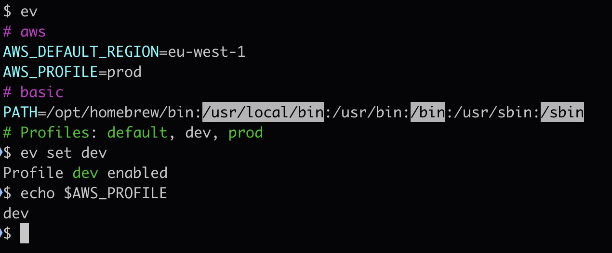

# envirou - View and manage your shell environment

[](https://github.com/sverrirab/envirou/actions/workflows/build.yml)
[](https://codecov.io/gh/sverrirab/envirou)
[](./LICENSE)

Envirou (`ev`) helps you to quickly view and configure your shell
environment. Display important variables with nice formatting and hide the ones you don't care about. No more custom shell scripts to configure your environment or guessing which one is active!




# Key highlights
* Works with any other tool - just views and optionally sets environment variables.
* Compact output (replaces `$HOME` with `~` and highlights paths for readability).
* Hides all irrelevant variables such as `TMPDIR`, `LSCOLORS` etc, etc.
* Fully customizable.
* Works on Mac + Linux (bash + zsh) and Windows (bat and PowerShell).
* Fully standalone go binary.
* Command completion support (bash, zsh, PowerShell, fish).
* Includes [oh-my-zsh](https://ohmyz.sh/) theme and PowerShell prompt script.


## Why?
Everyone that works with complex infrastructure or multiple development environments from the command line know the feeling of using the wrong toolchain or environment and having the nagging suspicion that you have mixed something up in your configuration. Classical examples
are PATH's to tools/SDK versions, external service endpoints for your PROD and DEV environments
etc etc.


## Install

**Binary download** (all platforms): grab the latest release from the [releases page](https://github.com/sverrirab/envirou/releases). This is the recommended method on Windows.

**Homebrew** (macOS/Linux):
```bash
brew install sverrirab/tap/envirou
```

**Go install**:
```bash
go install github.com/sverrirab/envirou@latest
```

**Chocolatey** (Windows):
```powershell
choco install envirou
```

<details>
<summary>Scoop (Windows, experimental)</summary>

Scoop support is experimental and may not work reliably.

```powershell
scoop bucket add sverrirab https://github.com/sverrirab/scoop-bucket
scoop install envirou
```

If you run into issues, use the binary download above instead.

</details>

## Quickstart
Run `envirou` to view your current environment or `envirou help` for more information.

## Shell integration
To get the full power of envirou you need to allow it to modify your environment (switch profiles).
This requires it to run in the context of the current shell via the `ev` wrapper function.

The easiest way to install is:
```
envirou install
```
This auto-detects your shell and adds the bootstrap line to your profile.
Use `--prompt` to also customize your PowerShell prompt, or `--dry-run` to preview changes.

You can also specify the shell explicitly:
```
envirou install zsh
envirou install powershell --prompt
```

To remove: `envirou install --uninstall`

<details>
<summary>Manual installation (if you prefer not to let envirou modify your profile)</summary>

You can use `envirou install --dry-run` to see exactly what would be added and where,
or add the bootstrap line yourself:

**Bash** — add to `.bashrc` (or `.bash_profile` on macOS):
```bash
eval "$(envirou bootstrap bash)"
```

**Zsh** — add to `.zshrc`:
```bash
eval "$(envirou bootstrap zsh)"
```

**PowerShell** — add to `$PROFILE`:
```powershell
Invoke-Expression (& envirou bootstrap powershell)
```

To also customize your PowerShell prompt with active profile display:
```powershell
Invoke-Expression (& envirou bootstrap powershell --prompt)
```

**Windows CMD**: see `envirou bootstrap bat`

To uninstall manually, remove the line you added above from your shell profile.

</details>

For more details:
* [Bash (and zsh) instructions](./bash/README.md)
* [PowerShell instructions](./powershell/README.md)

## Commands

### Everyday use

| Command | Description |
|---------|-------------|
| `ev` | Display current environment (grouped and formatted) |
| `ev set PROFILE [...]` | Activate one or more profiles (alias: `.`) |
| `ev find PATTERN` | Search env variable names and values (alias: `search`) |
| `ev path [VAR]` | Display path-like variables one entry per line |
| `ev profiles` | List all profiles (alias: `profile`, `p`) |
| `ev groups` | List all configured groups (alias: `group`, `g`) |

### Searching

| Command | Description |
|---------|-------------|
| `ev find PATH` | Substring — matches PATH, CLASSPATH, PATH_INFO, ... |
| `ev find 'PATH*'` | Prefix — matches PATH, PATH_INFO but not CLASSPATH |
| `ev find '*PATH'` | Suffix — matches PATH, CLASSPATH but not PATH_INFO |
| `ev find --name PATH` | Search names only |
| `ev find --value /usr/local` | Search values only |
| `ev find -i path` | Case-insensitive search |

Patterns without `*` are treated as substring matches. Add `*` to restrict to prefix or suffix matching — the same glob syntax used in config groups. **Quote patterns containing `*`** to prevent your shell from expanding them (e.g., `ev find 'PATH*'` not `ev find PATH*`).

Most commands have short aliases shown in the table above. Additionally `ev dotenv` can be written as `ev .env`.

### Inspecting path variables

| Command | Description |
|---------|-------------|
| `ev path` | Show all path-like variables with one entry per line |
| `ev path PATH` | Show a specific variable |
| `ev path --check` | Flag missing directories and duplicates |

See the [path guide](./docs/path.md) for details.

### Loading environment files

| Command | Description |
|---------|-------------|
| `ev dotenv` | Load variables from `.env` in current directory |
| `ev dotenv FILE [...]` | Load one or more specific `.env` files (last wins) |

See the [dotenv guide](./docs/dotenv.md) for syntax details and examples.

### Tracking changes

| Command | Description |
|---------|-------------|
| `ev snapshot` | Save current environment as a baseline (alias: `snap`) |
| `ev diff` | Show what changed since the snapshot |
| `ev diff --save NAME` | Create a new profile from the changes |
| `ev snapshot --reset` | Remove the saved snapshot |

See the [snapshot and diff guide](./docs/snapshots.md) for a walkthrough.

### Configuration

| Command | Description |
|---------|-------------|
| `envirou install` | Auto-install shell integration into your profile |
| `envirou install --uninstall` | Remove shell integration from your profile |
| `ev config` | Open config file in `$EDITOR` |
| `ev bootstrap bash\|zsh\|powershell\|bat` | Output shell integration script |
| `ev version` | Show version information |

Run `ev help` or `ev [command] --help` for full usage details.

## First time use

After installing and adding the shell integration, start a new shell and run
`ev -a` to list all environment variables grouped by category. Run `ev help`
for details of all available commands.

Next step is to check out `ev config` and start modifying the configuration. Create your own groupings and profiles!

## Example use cases
### AWS configuration
Add all your aws profiles in `~/.aws/config`. Then create an Envirou profile for each
that sets the `AWS_PROFILE` variable to the name of the AWS profile. This way you can
easily e.g. switch between `dev` and `prod` or even the default region or output formatting.

### Kubectl configuration
Copy your `~/.kube/config` into a new file for each environment. Create an Envirou
profile for each that sets the `KUBECONFIG` pointing to each file.

Make sure you set the default context in each file to be the correct one. This way you
can create different profiles that for example have a different default namespace.

## Example configuration

```inifile
[profile:basic]
PATH=/usr/local/bin:/usr/bin:/bin:/usr/sbin:/sbin
VIRTUAL_ENV
AWS_PROFILE

[profile:py3]
PATH^=/Users/sab/sdk/py3/bin
VIRTUAL_ENV=/Users/sab/sdk/py3

[profile:py2]
PATH^=/Users/sab/sdk/py2/bin
VIRTUAL_ENV=/Users/sab/sdk/py2

[profile:awsprod]
AWS_PROFILE=prod

[profile:awsdev]
AWS_PROFILE=dev
```

Now you can switch profiles by running `ev set py3 awsprod`.

See the [profiles guide](./docs/profiles.md) for more details on creating and using profiles, including `^=` (prepend) and `+=` (append) operators for PATH-like variables.


## Where does the name come from?
The name Envirou is inspired by Spirou the comic book character.
The alias `ev` is both short for *Envirou* and `env`.

## License

Free for any use see [MIT License](./LICENSE) for details.
