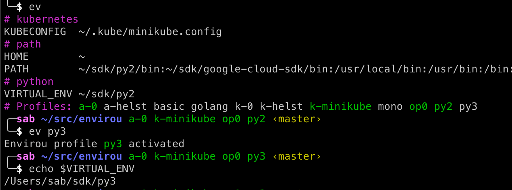

# envirou - View and manage your shell environment


Envirou (`ev`) helps you to quickly view and configure your shell 
 environment. Display important variables with nice formatting and hide the ones you don't care about. No more custom shell scripts to configure your environment or guessing which one is active!
 




# Key hightlights 
* Works with any other tool - just views and optionally sets environment variables.
* Compact output (replaces $HOME with `~` and _underscores_ paths for readability).
* Hides all irrelevant variables such as `TMPDIR`, `LSCOLORS` etc, etc.
* Fully customizable.
* Works on Mac + Linux (bash + zsh) and Windows.  
* Fully standalone go binary
* Command completion support (bash + zsh).
* Includes [oh-my-zsh](https://ohmyz.sh/) theme.


## Why?
Everyone that works with complex infrastructure or multiple development environments from the command line know the feeling of using the wrong toolchain or environment and having the nagging suspicion that you have mixed something up in your configuration. Classical examples 
are PATH's to tools/SDK versions, external service endpoints for your PROD and DEV environments
etc etc.


## Quickstart
1. You will need to have [go installed](https://go.dev/)
2. Install with `go install github.com/sverrirab/envirou@latest`
3. Run `envirou` to view your current environment or `envirou --help` for more information

## Full power of envirou
For the full power of envirou you will need to allow it to modify your environment (switch profiles).  This will require it to run in the context of the current shell.
The simplest way to that is to add this to your zsh configuration file `.zshrc` (or `.bashrc` if you are using bash):

```bash
# bash or zsh
ev() { eval "$(envirou "$@")"; }
```

After you start a new shell you should be able to run `ev`.  Possibly start with `ev --edit` to modify your configuration? 


## Example use cases
### AWS configuration
Add all your aws profiles in `~/.aws/config`.  Then create an Envirou profile for each
that sets the `AWS_PROFILE` variable to the name of the AWS profile.  This way you can
easily e.g. switch between `dev` and `prod` or even the default region or output formatting.

### Kubectl configuration
Copy your `~/.kube/config` into a new file for each environment.  Create an Envirou 
profile for each that sets the `KUBECONFIG` pointing to each file.

Make sure you set the default context in each file to be the correct one.  This way you
can create different profiles that for example have a different default namespace.

## Uninstalling envirou
1. Remove the shell function from your `.zshrc` / `.bashrc`
2. Remove the binary `rm $(which envirou)`
3. If you don't want to restart your current shell run `unset -f ev` (zsh) or `unset ev` (bash)

## Example configuration

```inifile
[profile:basic]
PATH=/usr/local/bin:/usr/bin:/bin:/usr/sbin:/sbin:/Users/sab/src/custom/bin
VIRTUAL_ENV
AWS_PROFILE

[profile:py3]
PATH=/Users/sab/sdk/py3/bin:/usr/local/bin:/usr/bin:/bin:/usr/sbin:/sbin:/Users/sab/src/custom/bin
VIRTUAL_ENV=/Users/sab/sdk/py3

[profile:py2]
PATH=/Users/sab/sdk/py2/bin:/usr/local/bin:/usr/bin:/bin:/usr/sbin:/sbin:/Users/sab/src/custom/bin
VIRTUAL_ENV=/Users/sab/sdk/py2

[profile:awsprod]
AWS_PROFILE=prod

[profile:awsdev]
AWS_PROFILE=dev
```


## Where does the name come from? 
The name Envirou is inspired by Spirou the comic book character.  
The alias `ev` is both short for *Envirou* and `env`. 


## But where is the python code?

The last version using python was [versions v4.4](https://github.com/sverrirab/envirou/releases/tag/v4.4)

## License

Free for any use see [MIT License](./LICENSE) for details.
